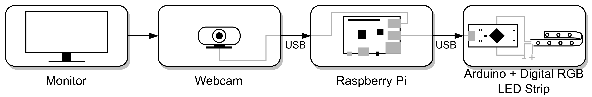

# Adalight-OpenCV
Ambient lighting for TVs using a webcam, OpenCV and Adalight-FastLED

This repository implements ambient lighting for TVs and monitors using a webcam. USB Webcam images are read from an application based on Python and OpenCV. The application detects the TV in the frame and determines colour values for each LED in a single strip mounted behind the TV.

## Required Components

- Microcontroller and digital RGB strips compatible with [FastLED](https://github.com/dmadison/Adalight-FastLED)
- USB Webcam
- PC to run the application on (e.g. Raspberry Pi)

The application is designed to be turned on and off using [MQTT](https://mqtt.org/). If you don't want to use MQTT, you can start [the main application file](./application.py) by any other means that suit your use case.

## Installation and Configuration

Set up your RGB LED strips and microcontroller as described in the [Adalight-FastLED repository](https://github.com/dmadison/Adalight-FastLED). You will need to power the LEDs using a 5V Power supply, with the data pin being connected to the microcontroller. By flashing the program provided in this repository to the microcontroller, colour data can be streamed to the microcontroller to be displayed on the LEDs. 

On the PC-side, install [Python 3](https://www.python.org/) (tested on Python 3.8.10), create a [virtual environment](https://docs.python.org/3/library/venv.html) and install required modules using `pip install -r requirements.txt`. On Linux, the user starting the application must be [added to the serial usergroup](https://www.howtogeek.com/50787/add-a-user-to-a-group-or-second-group-on-linux/). 

In the [configuration file](./config.json), the application can be configured to ideal parameters for a give use case. Important parameters are:

- **cameraName**: Name of the camera that should be used by the application. The name can be found on linux using [v4l2-utils](https://askubuntu.com/questions/348838/how-to-check-available-webcams-from-the-command-line)

- **portn**: Serial port that the microcontroller controlling the LEDs is connected to. Serial ports can be checked on linux as described [here](https://www.cyberciti.biz/faq/find-out-linux-serial-ports-with-setserial/)

- **baudr, numLEDs**: The baudrate and number of LEDs in the deployed strip. *These two parameters must match the configuration of Adalight-FastLED that is flashed to the microcontroller*

- **invertLEDOrder**: Inverts transmitted LED colours to match strip orientation to webcam orientation (possible values are 0 and 1)

Finally, connect the flashed microcontroller to the the PC and start [application.py](application.py) in the configured virtual environment. The intended way for the application to be started, is to add it as a systemd service to start it automaticall, as described [here](https://www.dexterindustries.com/howto/run-a-program-on-your-raspberry-pi-at-startup/). A sample service [configuration](./adalight.service) is provided in the repository. It assumes the repository and virtual environment to be located in */home/pi/git/Adalight-OpenCV* and */home/pi/myenv* respectively.

## Further Improvements

The following aspects are currently being worked on:

- Per-channel colour correction
- Smarter dimensionality reduction of on-screen colours
- Dynamic brightness
